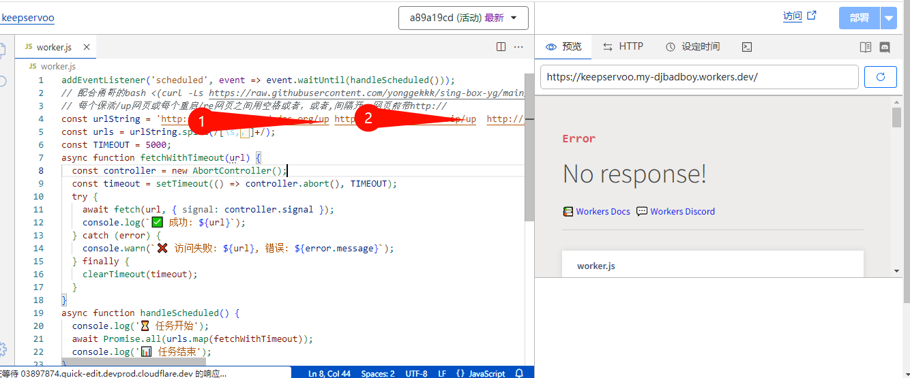
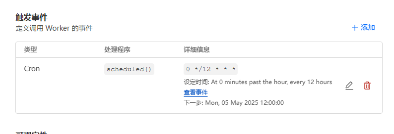

### webhost/dataonline 利用借鉴勇哥的serv00保活 哪怕节点不通可以利用Cf定时保活检查
# 方法：
# 1.'新建 cf works 复制works-onlive肉容到CF works上'

# 2.把webhost要拉活的域名/sub

# 3.变里下面  
#   触发事件 定义调用 Worker 的事件

# [参考fox教程](https://blog.qianhuya.me/s/node-ws/)
